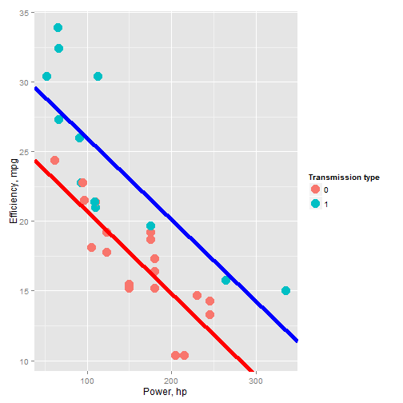

## Car efficiency prediction

 
 
 
  Author Kirill Zhuravlev
  
 
 
 
  
  Course Developing Data Products
  
 
 
 
  
  Done: 2016

---

## Importance of the problem

 
 
 
 - Car efficiency prediction is important for several groups of people:
 - 1) Self-employed (pizza delivery, newspaper delivery, babysitters, tutors etc.)
 - 2) Frequent travelers (salespersons, advertisers)
 - 3) Small businesses (fast-food, pet grooming, carpet/house cleaning, yard/lawn management, etc.)

---

## Importance of the problem (cont.)

 
 
 
 - Costs of fuel are important in planning and managing business, may constitute significant portion of costs
 - How efficient is the car you or your business use? Can we predict it based on its power?
 - Does efficiency depend on the transmission type of your vehicle?
 - We present new algorithm allowing one to predict the car fuel        consumption efficiency (measured in miles per gallon of fuel) if the car power and its transmission type are given.

---

### Data used to build the prediction model

P-value is 0.0013, showing the statistical significance of the difference between two types of transmission.

---

### Data with the linear regression models

Blue and red lines are best linear fits for cars with manual and automatic transmission, respectively.

---

### Web application done using shiny

 
 
 
Data was taken from 1974 Motor Trend US magazine. We used simple linear regression model to predict the efficiency of a vehicle based on its power, measured in horsepowers.
 
 
 
Link to application:
https://kzhuravlev.shinyapps.io/My_data_product_project/

